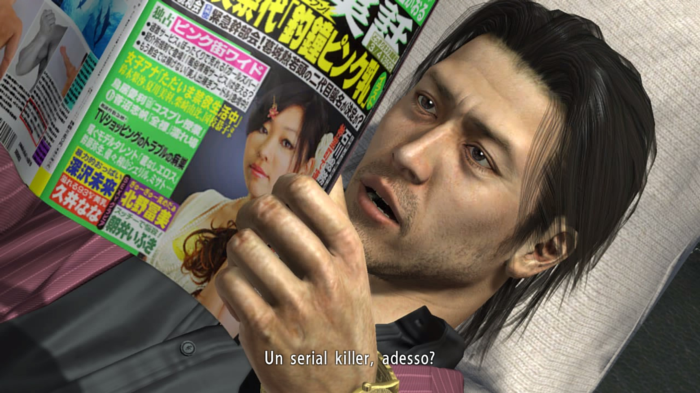
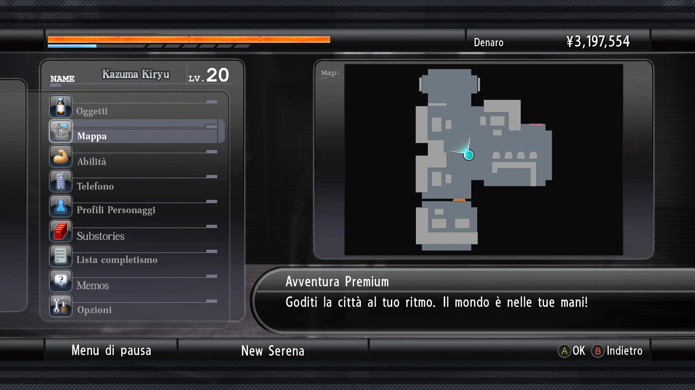
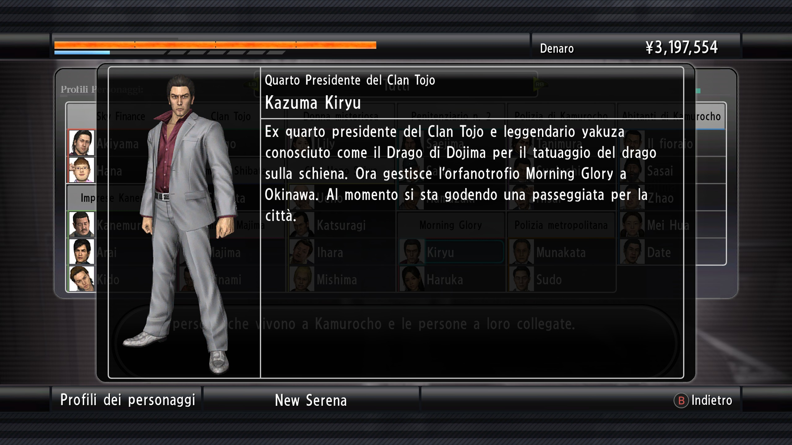
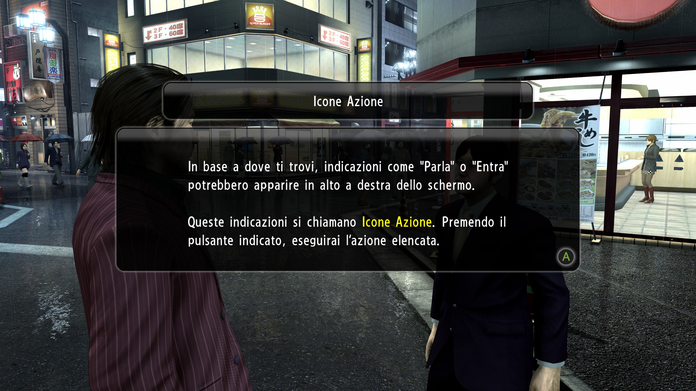

# Yakuza 4  Remastered Patch ITA
<p align="center">
  <br>
    Progetto per la traduzione del gioco Yakuza 4 REMASTERED in italiano.
</p>


[](https://www.paypal.com/paypalme/verio12)


Il "progetto" è nato totalmente a caso e spinto dalla mia curiosità nel riuscire a modificare i testi del gioco, dopo aver provato la Patch per Yakuza 0 sviluppata da [Rulesless](https://letraduzionidirulesless.wordpress.com/yakuza0-2/).
La mia ricerca è iniziata cercando sul web l'esistenza di altre patch di traduzioni in altre lingue, per poter analizzare la patch e comprendere più velocemente quali siano i file contenenti i testi del gioco.
Per questo motivo ho iniziato ad analizzare la [patch spagnola](https://steamcommunity.com/sharedfiles/filedetails/?id=3385318071) del gioco.
Analizzando i file, mi sono accorto che principalmente il gioco utilizza file _PAR_ e file _BIN_ (con varianti di quest'ultimi in alcuni casi). I file PAR contengono i principali dati del gioco (immagini, animazioni ecc...) e lo stesso vale per i file BIN. Su GitHub, casualmente, ho trovato alcune repository che permettono di scompattare e ricompattare questi file. In tal modo, ho iniziato a comprendere come muovere i primi passi per la traduzione dei testi del gioco.

# Immagini Patch










# Come installare la patch

Per installare bisogna selezionare la sezione [Releases](https://github.com/zSavT/Yakuza4-Patch-ITA/releases) su GitHub e selezionare l'ultima versione della patch disponibile. Selezionate l'installer da scaricare in base al sistema operativo scelto ed avviate l'installer.


L'installazione è guidata e semplice, ma in ogni caso basterà sempre cliccare su "_Avanti_". Attendere la verifica dell'integrità dei file della Patch e cliccare successivamente su "_Avanti_".


Successivamente bisogna accettare i termini d'uso e poi nella schermata successiva, selezionare la cartella dove è installato Yakuza 4 (Di default è impostato il percorso classico) e cliccare su "_Installa Patch_".


# Struttura dei file

- __Yakuza 4\data\auth\subtitle.par__
    - All'interno sono presenti tutti i testi per le cutscene presenti nel gioco.
    - [x] Tradotto 
- __Yakuza 4\data\hact\subtitle.par__
    - All'interno sono presenti tutti i testi non presenti nelle cutscene o nei classi box di dialogo o menu.
    - [x] Tradotto 
- __Yakuza 4\data\2d\cse_en.pa__
    - All'interno sono presenti la maggior parte delle grafiche del gioco, in particolare quelle per l'immagine di introduzione dei capitoli e degli obbiettivi.
    - [x] Tradotto
- __Yakuza 4\data\2d\first_load_picture_en.par__
    - All'interno sono presenti le immagine degli splash screen del primo avvio del gioco.
    - [x] Tradotto
- __Yakuza 4\data\2d\tex_common_en.par__
    - All'interno sono presenti le immagine del menu del gioco.
    - [x] Tradotto
- __Yakuza 4\data\staffrollpar__
    - All'interno sono presenti le immagine dei crediti finali del gioco.
    - [x] Tradotto
- __Yakuza 4\data\pause_en.par__
    - All'interno sono presenti i testi del gioco relativi ai memo ed altro.
    - [x] Tradotto
- __Yakuza 4\data\ikusei_param_en.par__
    - All'interno sono presenti i testi del gioco relativi al colosseo.
    - [x] Tradotto

# Funzionamento estrazione PAR

Per estrarre i dati dai file PAR, è necessario utilizzare il programma "_ParTool_", sviluppato da Kaplas80 e disponibile nella [repository](https://github.com/Kaplas80/ParManager.git). Nella cartella PAR è presente il tool per comodità, insieme a un file batch per ricompattare i file. Per scompattare un file PAR, è sufficiente trascinare il file sull'eseguibile; verrà creata una cartella contenente tutti i file presenti nel file PAR. Lo stesso processo, con maggiori opzioni, può essere eseguito tramite riga di comando (per maggiori informazioni, si può consultare la repository originale).

Per ricreare il file PAR dopo le modifiche, è possibile utilizzare il file batch (modificando, se necessario, solo i parametri di input e output) oppure tramite riga di comando, come nell'esempio seguente:

```
.\ParTool.exe create [nome cartella di input] [nome file par output] -c 1
```
Ovviamente, le parentesi quadre non devono essere incluse nel comando.

# Funzionamento script sottotitoli

Lo script utilizza le api di Gemini 2.0 per poter funzionare. Le API al momento sono utilizzabili gratuitamente (per ora). La chiave si può ottenere da [qui](https://aistudio.google.com/apikey).<br> i file csv presenti nella cartella "_input_". Output dell'operazione è salvato nella cartella "_tradotto_".
Bisogna inserire la chiave all'interno del file "_traduttore_auto_csv/api_key.txt_" oppure lanciando lo script python tramite il flag "_--api [CHIAVE_API]_".
Ovviamente bisogna sostituire "_CHIAVE API_" con la propria chiave.

```
python .\main.py --api [CHIAVE_API]
```
Altri flag utilizzabili sono:
```py
--input [CARTELLA_INPUT] # Sono presenti tutti 
--oneThread # Non crea il thread secondario per la stampa del messaggio "Traducendo..."
```

## Struttura file CSV

I file csv del gioco hanno il seguente formato:

```sql
INTEGER INTEGER TEXT
```
Esempio
```py
293	326	Answer me.
2058	2177	You seem real tense.\nSomething happen?
```

La codifica dei file csv è "__UTF-16__".
La lunghezza massima di caratteri visualizzabili in una cutscene è "__99__". Le virgolette si inseriscono con una tripla di virgolette.
```py
"""Ciao"""
```

# Funzionamento estrazione BIN 2007.03.19

Per estrarre i dati dai file BIN 2007.03.19, è necessario utilizzare il programma "_20070319_", sviluppato da SlowpokeVG e disponibile nella [repository](https://github.com/SlowpokeVG/Yakuza-2007.03.19-bin-file-exporter-importer). Il programma si utilizza tramite riga di comando. Il programma ha 4 "eseguibili", due per estrarre e due per ricompattare. In particolare, se l'output ottenuto non è chiaro, è necessario utilizzare la variante "_CP932_".

Esempio di estrazione:
```
20070319exporter.exe [nome file bin]
```
Esempio di importazione:
```
20070319importer.exe [nome file json]
```

# Funzionamento installer

Per poter creare correttamente l'installer bisogna prima di tutto utilizzare ```packager.py``` per poter generare il file criptato della cartella "_data_". Lo script è guidato e bisogna solo indicare il percorso della cartella con le modifiche della Patch ed il nome del file pkg criptato. Nel file "chiave.txt" bisogna inserire la chiave di criptazione scelta.

## Creazione dell'eseguibile

Per poter generare l'eseguibile dello script bisogna utilizzare la libreria "__pyinstaller__" e generare l'eseguibile con i comandi in base al sistema operativo di arrivo.

### Windows

Per generare l'eseguibile dell'installer per Windows, bisogna utilizzare il seguente comando:
```ps
pyinstaller --onefile --windowed --hidden-import=webbrowser --hidden-import=pyzipper --hidden-import=sys --hidden-import=os --hidden-import=platform --hidden-import=traceback --hidden-import=PyQt6 --icon=assets/logo.png --add-data "assets:assets" --add-data "patch.pkg:." --add-data "chiave.txt:." installer.py
```
Nella cartella "_dist_", è presente l'eseguibile.
### Linux (Steam Deck)

Per generare l'eseguibile per Linux, bisogna fare qualche passaggio in più. L'installer è creato tramite la WSL per Windows.
Per prima cosa bisogna creare l'ambiente virtuale per python tramite il comando:
```
source venv
```
Dopo aver generato l'ambiente, bisogna attivare l'ambiente, con il seguente comando:
```
source venv/bin/activate
```
Successivamente bisogna avviare il comando per la creazione del file eseguibile:
```ps
pyinstaller --onefile --windowed --hidden-import=webbrowser --hidden-import=pyzipper --hidden-import=sys --hidden-import=os --hidden-import=platform --hidden-import=traceback --hidden-import=PyQt6 --icon=assets/logo.png --add-data "assets:assets" --add-data "patch.pkg:." --add-data "chiave.txt:." installer.py
```
Nella cartella "_dist_", è presente l'eseguibile (la versione per Linux non ha tipo/estensione).

## TO DO

- [x] Codifica e decodifica dei file PAR
- [x] Codifica e decodifica dei file BIN 2007.03.19
- [ ] Modifica al Font

# Altre patch della serie

Lista dei progetti di patch in italiano per i giochi della serie:
- [Yakuza 0](https://letraduzionidirulesless.wordpress.com/yakuza0-2/)
    - Come indicato nell'introduzione, la patch di Yakuza 0 è l'unica completa al 100% (o quasi).
- [Yakuza Kiwami 1 e 2](https://vittolarosa93.wixsite.com/kiwamivideo)
    - L'autore ha rilasciato sul sito delle patch parziali dei giochi/video dimostrativi.
- [Yakuza 3 Remastered](https://vittolarosa93.wixsite.com/kiwamivideo)
    - L'autore ha rilasciato sul sito delle patch parziali del gioco/video dimostrativo.
- Yakuza 4 Remastered
    - Questo progetto
- [Yakuza 5 Remastered](https://github.com/zSavT/Yakuza5-Patch-ITA)
    - Un'altra patch realizzata da me per la serie Yakuza è quella di Yakuza 5, il funzionamento ed il materiale tradotto è il medesimo.

__N.B.__<br>
Chi ha realizzato la patch per Yakuza 1 - 2 - 3, sta lavorando anche ad una patch totale per Yakuza 4 - 5 - 6.
Gli autori sono liberi di attingere da questa progetto, previo avviso.

## Dipendenza
Si ringrazia

- Per la codifica e la decodifica dei file _PAR_ del gioco, si utilizza il programma sviluppato nella [repo](https://github.com/Kaplas80/ParManager.git) da Kaplas80.<br>
- Per la codifica e la decodifica dei file BIN 2007.03.19 del gioco, si utilizza il programma sviluppato nella [repo](https://github.com/SlowpokeVG/Yakuza-2007.03.19-bin-file-exporter-importer) da SlowpokeVG.

## Copyright
This patch does not contain copyrighted material, has no functional autonomy, and you must have your original own copy to apply it.
All game rights, intellectual property, logo/names and movies/images are property of Sega Corporation.

# Altri progetti di traduzione realizzati da me
[Valkyria Chronicles Patch ITA](https://github.com/zSavT/Valkyria-Chronicles-Patch-ITA)
