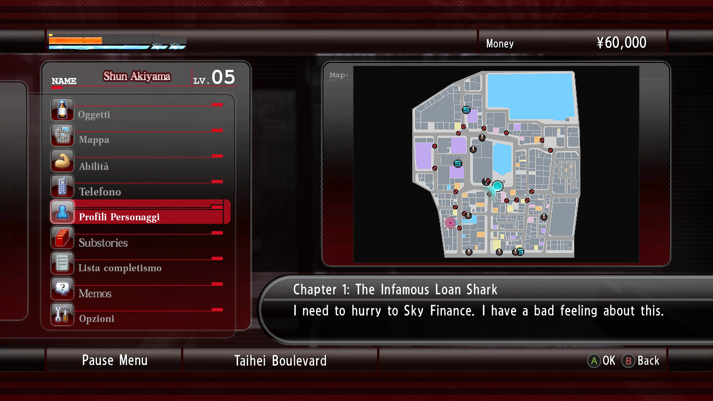
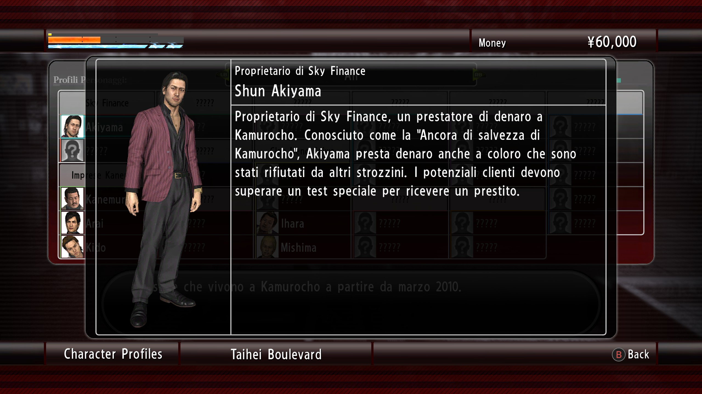
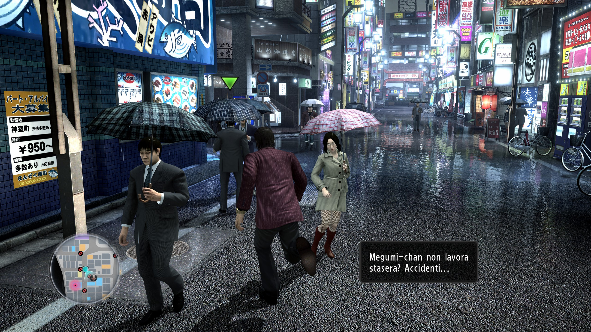
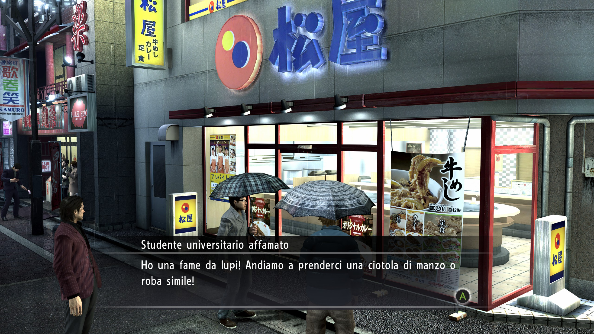
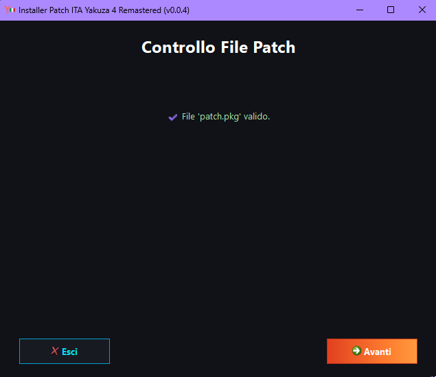
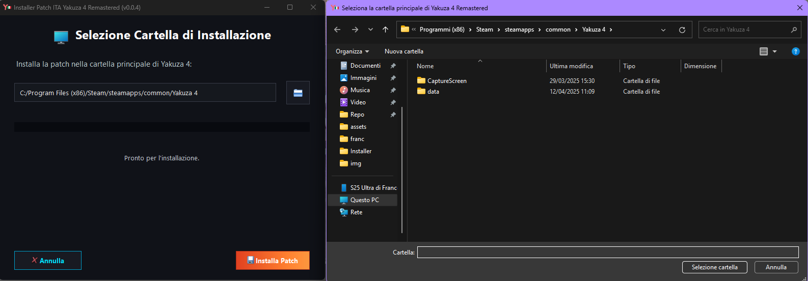

# Yakuza 4  Remastered Patch ITA
<p align="center">
  <br>
    Progetto per la traduzione del gioco Yakuza 4 REMASTERED in italiano.
</p>


[](https://www.paypal.com/paypalme/verio12)


Il "progetto" è nato totalmente a caso e spinto dalla mia curiosità nel riuscire a modificare i testi del gioco, dopo aver provato la Patch per Yakuza 0 sviluppata da [Rulesless](https://letraduzionidirulesless.wordpress.com/yakuza0-2/).
La mia ricerca è iniziata cercando sul web l'esistenza di altre patch di traduzioni in altre lingue, per poter analizzare la patch e comprendere più velocemente quali siano i file contenenti i testi del gioco.
Per questo motivo ho iniziato ad analizzare la [patch spagnola](https://steamcommunity.com/sharedfiles/filedetails/?id=3385318071) del gioco.
Analizzando i file, mi sono accorto che principalmente il gioco utilizza file _PAR_ e file _BIN_ (con varianti di quest'ultimi in alcuni casi). I file PAR contengono i principali dati del gioco (immagini, animazioni ecc...) e lo stesso vale per i file BIN. Su GitHub, casualmente, ho trovato alcune repository che permettono di scompattare e ricompattare questi file. In tal modo, ho iniziato a comprendere come muovere i primi passi per la traduzione dei testi del gioco.
Puoi comprare il gioco [qui](https://www.instant-gaming.com/?igr=gamer-bf238e) in sconto.
Ringrazio "[Lowrentio](https://steamcommunity.com/id/Lowrentio/)" per aver deciso di condividere i nuovi tool e le sue traduzioni del gioco.

# Immagini Patch











# Come installare la patch

Per installare bisogna selezionare la sezione [Releases](https://github.com/zSavT/Yakuza4-Patch-ITA/releases) su GitHub e selezionare l'ultima versione della patch disponibile. Selezionate l'installer da scaricare in base al sistema operativo scelto ed avviate l'installer.


L'installazione è guidata e semplice, ma in ogni caso basterà sempre cliccare su "_Avanti_". Attendere la verifica dell'integrità dei file della Patch e cliccare successivamente su "_Avanti_".



Successivamente bisogna accettare i termini d'uso e poi nella schermata successiva, selezionare la cartella dove è installato Yakuza 4 (Di default è impostato il percorso classico) e cliccare su "_Installa Patch_".



# Struttura dei file

- __Yakuza 4\data\2d\cse_en.pa__
    - All'interno sono presenti la maggior parte delle grafiche del gioco, in particolare quelle per l'immagine di introduzione dei capitoli e degli obbiettivi.
    - [x] Tradotto
- __Yakuza 4\data\2d\first_load_picture_en.par__
    - All'interno sono presenti le immagine degli splash screen del primo avvio del gioco.
    - [x] Tradotto
- __Yakuza 4\data\2d\tex_common_en.par__
    - All'interno sono presenti le immagine del menu del gioco.
    - [x] Tradotto
- __Yakuza 4\data\auth\subtitle.par__
    - All'interno sono presenti tutti i testi per le cutscene presenti nel gioco.
    - [x] Tradotto
- __Yakuza 4\data\bootpar\*__
    - All'interno sono presenti vari file relativi a nomi di oggetti, descrizioni e altro.
    - [x] Tradotto in parte
- __Yakuza 4\data\db.soul\*__
    - Come sopra.
    - [x] Tradotto
- __Yakuza 4\data\fontpar__
    - All'interno sono presenti i dati relativo al font del gioco.
    - [x] Tradotto
- __Yakuza 4\data\hact\subtitle.par__
    - All'interno sono presenti tutti i testi non presenti nelle cutscene o nei classi box di dialogo o menu.
    - [x] Tradotto
- __Yakuza 4\data\minigame\*__
    - All'interno sono presenti vari file relativi ai minigiochi.
    - [x] Tradotto
- __Yakuza 4\data\pause_en.par__
    - All'interno sono presenti i testi del gioco relativi ai memo ed altro.
    - [x] Tradotto
- __Yakuza 4\data\scenario_en\mail__
    - All'interno è presente il testo delle email/sms.
    - [x] Tradotto
- __Yakuza 4\data\staffrollpar__
    - All'interno sono presenti le immagine dei crediti finali del gioco.
    - [x] Tradotto
- __Yakuza 4\data\ikusei_param_en.par__
    - All'interno sono presenti i testi del gioco relativi al colosseo.
    - [x] Tradotto ma con limitazioni
- __Yakuza 4\data\wdr_par_en\*__
    - All'interno sono presenti i file relativi ai box di dialogo della storia e interazioni con i negozi.
    - [x] Tradotto

# Funzionamento estrazione PAR

Per estrarre i dati dai file PAR, è necessario utilizzare il programma "_ParTool_", sviluppato da Kaplas80 e disponibile nella [repository](https://github.com/Kaplas80/ParManager.git). Nella cartella PAR è presente il tool per comodità, insieme a un file batch per ricompattare i file. Per scompattare un file PAR, è sufficiente trascinare il file sull'eseguibile; verrà creata una cartella contenente tutti i file presenti nel file PAR. Lo stesso processo, con maggiori opzioni, può essere eseguito tramite riga di comando (per maggiori informazioni, si può consultare la repository originale).

Per ricreare il file PAR dopo le modifiche, è possibile utilizzare il file batch (modificando, se necessario, solo i parametri di input e output) oppure tramite riga di comando, come nell'esempio seguente:

```
.\ParTool.exe create [nome cartella di input] [nome file par output] -c 1
```
Ovviamente, le parentesi quadre non devono essere incluse nel comando.

# Funzionamento script sottotitoli

Lo script utilizzato per la pre-traduzione dei testi è [Alumen](https://github.com/zSavT/Alumen.git) che utilizza le api di Gemini 2.5 per poter funzionare. Maggiori informazioni sono presenti nella repository del tool.

## Struttura file CSV

I file csv del gioco hanno il seguente formato:

```sql
INTEGER INTEGER TEXT
```
Esempio
```py
293	326	Answer me.
2058	2177	You seem real tense.\nSomething happen?
```

La codifica dei file csv è "__UTF-16__".
La lunghezza massima di caratteri visualizzabili in una cutscene è "__99__". Le virgolette si inseriscono con una tripla di virgolette.
```py
"""Ciao"""
```

# Funzionamento estrazione BIN 2007.03.19

Per estrarre i dati dai file BIN 2007.03.19, è necessario utilizzare il programma "_20070319_", sviluppato da SlowpokeVG e disponibile nella [repository](https://github.com/SlowpokeVG/Yakuza-2007.03.19-bin-file-exporter-importer). Il programma si utilizza tramite riga di comando. Il programma ha 4 "eseguibili", due per estrarre e due per ricompattare. In particolare, se l'output ottenuto non è chiaro, è necessario utilizzare la variante "_CP932_".

Esempio di estrazione:
```
20070319exporter.exe [nome file bin]
```
Esempio di importazione:
```
20070319importer.exe [nome file json]
```

# Funzionamento estrazione MSG

Per i file MSG, si utilizza il programma realizzato da ma [BZ](https://brazilalliance.com.br/).

# Funzionamento installer

Per poter creare correttamente l'installer bisogna prima di tutto utilizzare ```packager.py``` per poter generare il file criptato della cartella "_data_". Lo script è guidato e bisogna solo indicare il percorso della cartella con le modifiche della Patch ed il nome del file pkg criptato. Nel file "chiave.txt" bisogna inserire la chiave di criptazione scelta.

## Creazione dell'eseguibile

Per poter generare l'eseguibile dello script bisogna utilizzare la libreria "__pyinstaller__" e generare l'eseguibile con i comandi in base al sistema operativo di arrivo.

### Windows

Per generare l'eseguibile dell'installer per Windows, bisogna utilizzare il seguente comando:
```ps
pyinstaller --onefile --windowed --hidden-import=webbrowser --hidden-import=pyzipper --hidden-import=sys --hidden-import=os --hidden-import=platform --hidden-import=traceback --hidden-import=PyQt6 --icon=assets/logo.png --add-data "assets:assets" --add-data "patch.pkg:." --add-data "patch_ai.pkg:."--add-data "chiave.txt:." installer.py
```
Nella cartella "_dist_", è presente l'eseguibile.
### Linux (Steam Deck)

Per generare l'eseguibile per Linux, bisogna fare qualche passaggio in più. L'installer è creato tramite la WSL per Windows.
Per prima cosa bisogna creare l'ambiente virtuale per python tramite il comando:
```ps
python3 -m venv venv
```
Se non fosse presente la funzione nell'ambiente, si può installare tramite il seguente comando:
```ps
sudo apt-get install -y python3-venv
```
Con il comando seguente, attiviamo l'ambiente:
```ps
source venv/bin/activate
```
Dopo aver attivato l'ambiente bisogna installare pyinstaller con il comando:
```ps
pip3 install pyinstaller
```
Se pip non è presente nell'ambiente, bisogna installarlo con il comando:
```ps
sudo apt install -y python3-pip
```
Successivamente bisogna installare tutte le librerie utilizzate, presenti nel file requirements.txt, che in ogni caso sono:

- PyQt6
- pyzipper

Successivamente bisogna avviare il comando per la creazione del file eseguibile:
```ps
pyinstaller --onefile --windowed --hidden-import=webbrowser --hidden-import=pyzipper --hidden-import=sys --hidden-import=os --hidden-import=platform --hidden-import=traceback --hidden-import=PyQt6 --icon=assets/logo.png --add-data "assets:assets" --add-data "patch.pkg:." --add-data "patch_ai.pkg:." --add-data "chiave.txt:." installer.py
```

Una volta terminato, si può disattivare l'ambiente con il commando:
```ps
deactivate
```

Nella cartella "_dist_", è presente l'eseguibile (la versione per Linux non ha tipo/estensione).

## TO DO

- [x] Codifica e decodifica dei file PAR
- [x] Codifica e decodifica dei file BIN 2007.03.19
- [x] Codifica e decodifica dei restanti file BIN
- [x] Codifica e decodifica dei file MSG
- [x] Modifica al Font

# Altre patch della serie

Lista dei progetti di patch in italiano per i giochi della serie:
- [Yakuza 0](https://letraduzionidirulesless.wordpress.com/yakuza0-2/)
    - Come indicato nell'introduzione, la patch di Yakuza 0 è l'unica completa al 100% (o quasi).
    - La versione Director's Cut, presenta la lingua italiana.
- [Yakuza Kiwami 1 e 2](https://vittolarosa93.wixsite.com/kiwamivideo)
    - L'autore ha rilasciato sul sito delle patch parziali dei giochi/video dimostrativi.
    - Verrà pubblicata prossimamente una patch ufficiale con al suo interno anche la traduzione in italiano.
- [Yakuza 3 Remastered](https://vittolarosa93.wixsite.com/kiwamivideo)
    - L'autore ha rilasciato sul sito delle patch parziali del gioco/video dimostrativo.
    - Il remake del gioco (e non la remastered) sarà localizzato in italiano.
- Yakuza 4 Remastered
    - Questo progetto
- [Yakuza 5 Remastered](https://github.com/zSavT/Yakuza5-Patch-ITA)
    - Un'altra patch realizzata da me per la serie Yakuza è quella di Yakuza 5, il funzionamento ed il materiale tradotto è il medesimo.
- [Yakuza 6](https://www.nexusmods.com/yakuza6/mods/220)
    - Un ragazzo ha tradotto i sottotitoli delle cutscene e alcuni menu


## Dipendenza e ringraziamenti
Si ringrazia

- Per la codifica e la decodifica dei file _PAR_ del gioco, si utilizza il programma sviluppato nella [repo](https://github.com/Kaplas80/ParManager.git) da Kaplas80.<br>
- Per la codifica e la decodifica dei file BIN 2007.03.19 del gioco, si utilizza il programma sviluppato nella [repo](https://github.com/SlowpokeVG/Yakuza-2007.03.19-bin-file-exporter-importer) da SlowpokeVG.
- Per la modifica dei font, è stata realizzata partendo dalla mod 4K dei font reperibile da [qui](https://www.nexusmods.com/yakuza4remastered/mods/14) realizzata da Chalkint.
- Per la codifica dei file _MSG_, _BIN_ del gioco, si utilizza il programma sviluppato da [BZ](https://brazilalliance.com.br/).

## Copyright
This patch does not contain copyrighted material, has no functional autonomy, and you must have your original own copy to apply it.
All game rights, intellectual property, logo/names and movies/images are property of Sega Corporation.

# Altri progetti di traduzione realizzati da me
[Valkyria Chronicles Patch ITA](https://github.com/zSavT/Valkyria-Chronicles-Patch-ITA)


[Digimon Story Cyber Sleuth: Complete Edition](https://github.com/zSavT/Digimon-Story-Cyber-Sleuth-Patch-ITA.git)
